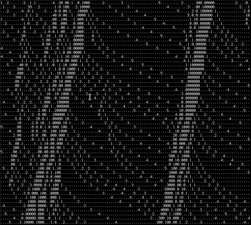

# CellularFreeway

This program is an attempt at programming a cellular automaton model for freeway traffic as laid out by Kai Nagel and Michael Schreckenberg [in their abstract](http://www.pd.infn.it/~agarfa/didattica/met_comp/lab_20140108/1992_origca.pdf).

This simulation can be run indefinitely or up to a certain amount of steps with an optional launch parameter.  

## How to launch CellularFreeway

Use the Main class to launch the program. You need to enter at least four numerical values as command line arguments to successfully start the simulation. The source code itself can also be compiled using the Java 1.8 SDK.

Launching the program in a command-line interface, for example, would look like this:

<code>"./Java main [length of street in cells] [amount of cars on street] [decimal probability number] [time interval between simulation steps] [optional: amount of steps]"</code>