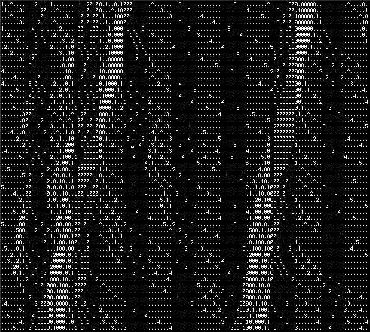

# CellularFreeway

This program is an attempt at programming a cellular automaton model for freeway traffic as laid out by Kai Nagel and Michael Schreckenberg [in their paper](http://www.pd.infn.it/~agarfa/didattica/met_comp/lab_20140108/1992_origca.pdf).

This simulation can be run indefinitely or up to a certain amount of steps with an optional launch parameter.  

## How to launch CellularFreeway

Use the main class to launch the program. The source code itself can also be compiled using the Java 1.8 SDK.

Launching the program in a command-line interface would look like this:
"./Java main [length of street in cells] [amount of cars on street] [decimal propability number] [time interval between simulation steps] [optional: amount of steps]"